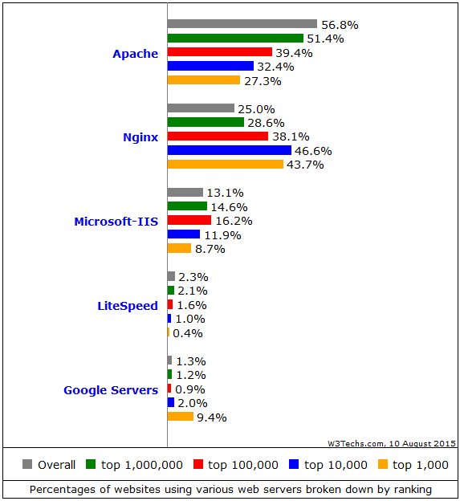

# WEB发展

在Linux Socket服务器短编程时，为了处理大量客户的连接请求，需要使用非阻塞I/O和复用，select、poll和epoll是Linux API提供的I/O复用方式，自从Linux 2.6中加入了epoll之后，在高性能服务器领域得到广泛的应用，现在比较出名的nginx就是使用epoll来实现I/O复用支持高并发，目前在高并发的场景下，nginx越来越收到欢迎。

据 w3techs 2015年 8月 10 日的统计数据表明，在全球 Top 1000 的网站中，有 43.7% 的网站在使用 Nginx，这使得 Nginx 超越了 Apache，成为了高流量网站最信任的 Web 服务器足足有两年时间。已经确定在使用Nginx的站点有：Wikipedia, WordPress, Reddit, Tumblr, Pinterest, Dropbox, Slideshare, Stackexchange等，估计我们可以持续好几个小时也写不完。

下图是统计数据：



#### select

下面是select的函数接口：

```
int select (int n, fd_set *readfds, fd_set *writefds, fd_set *exceptfds, struct timeval *timeout);
```

select 函数监视的文件描述符分3类，分别是writefds、readfds、和exceptfds。调用后select函数会阻塞，直到有描述副就绪（有数据 可读、可写、或者有except），或者超时（timeout指定等待时间，如果立即返回设为null即可），函数返回。当select函数返回后，可以 通过遍历fdset，来找到就绪的描述符。

select目前几乎在所有的平台上支持，其良好跨平台支持也是它的一个优点。select的一 个缺点在于单个进程能够监视的文件描述符的数量存在最大限制，在Linux上一般为1024，可以通过修改宏定义甚至重新编译内核的方式提升这一限制，但是这样也会造成效率的降低。

#### poll

```
int poll (struct pollfd *fds, unsigned int nfds, int timeout);
```

不同与select使用三个位图来表示三个fdset的方式，poll使用一个 pollfd的指针实现。

```
struct pollfd {
    int fd; /* file descriptor */
    short events; /* requested events to watch */
    short revents; /* returned events witnessed */
};
```

pollfd结构包含了要监视的event和发生的event，不再使用select“参数-值”传递的方式。同时，pollfd并没有最大数量限制（但是数量过大后性能也是会下降）。 和select函数一样，poll返回后，需要轮询pollfd来获取就绪的描述符。

从上面看，select和poll都需要在返回后，通过遍历文件描述符来获取已经就绪的socket。事实上，同时连接的大量客户端在一时刻可能只有很少的处于就绪状态，因此随着监视的描述符数量的增长，其效率也会线性下降。

#### epoll

epoll的接口如下：

```
int epoll_create(int size)；
int epoll_ctl(int epfd, int op, int fd, struct epoll_event *event)；
            typedef union epoll_data {
                void *ptr;
                int fd;
                __uint32_t u32;
                __uint64_t u64;
            } epoll_data_t;

            struct epoll_event {
                __uint32_t events;      /* Epoll events */
                epoll_data_t data;      /* User data variable */
            };

int epoll_wait(int epfd, struct epoll_event * events, int maxevents, int timeout);
```


主要是epoll_create,epoll_ctl和epoll_wait三个函数。epoll_create函数创建epoll文件描述符，参数size并不是限制了epoll所能监听的描述符最大个数，只是对内核初始分配内部数据结构的一个建议。返回是epoll描述符。-1表示创建失败。epoll_ctl 控制对指定描述符fd执行op操作，event是与fd关联的监听事件。op操作有三种：添加EPOLL_CTL_ADD，删除EPOLL_CTL_DEL，修改EPOLL_CTL_MOD。分别添加、删除和修改对fd的监听事件。epoll_wait 等待epfd上的io事件，最多返回maxevents个事件。

在 select/poll中，进程只有在调用一定的方法后，内核才对所有监视的文件描述符进行扫描，而epoll事先通过epoll_ctl()来注册一 个文件描述符，一旦基于某个文件描述符就绪时，内核会采用类似callback的回调机制，迅速激活这个文件描述符，当进程调用epoll_wait() 时便得到通知。

epoll的优点主要是一下几个方面：

1. 监视的描述符数量不受限制，它所支持的FD上限是最大可以打开文件的数目，这个数字一般远大于2048,举个例子,在1GB内存的机器上大约是10万左 右，具体数目可以cat /proc/sys/fs/file-max察看,一般来说这个数目和系统内存关系很大。select的最大缺点就是进程打开的fd是有数量限制的。这对 于连接数量比较大的服务器来说根本不能满足。虽然也可以选择多进程的解决方案( Apache就是这样实现的)，不过虽然linux上面创建进程的代价比较小，但仍旧是不可忽视的，加上进程间数据同步远比不上线程间同步的高效，所以也不是一种完美的方案。
2. IO的效率不会随着监视fd的数量的增长而下降。epoll不同于select和poll轮询的方式，而是通过每个fd定义的回调函数来实现的。只有就绪的fd才会执行回调函数。
3. 支持水平触发和边沿触发（只告诉进程哪些文件描述符刚刚变为就绪状态，它只说一遍，如果我们没有采取行动，那么它将不会再次告知，这种方式称为边缘触发）两种方式，理论上边缘触发的性能要更高一些，但是代码实现相当复杂（Nginx是使用边缘触发的哦）。
4. mmap加速内核与用户空间的信息传递。epoll是通过内核于用户空间mmap同一块内存，避免了无畏的内存拷贝。
