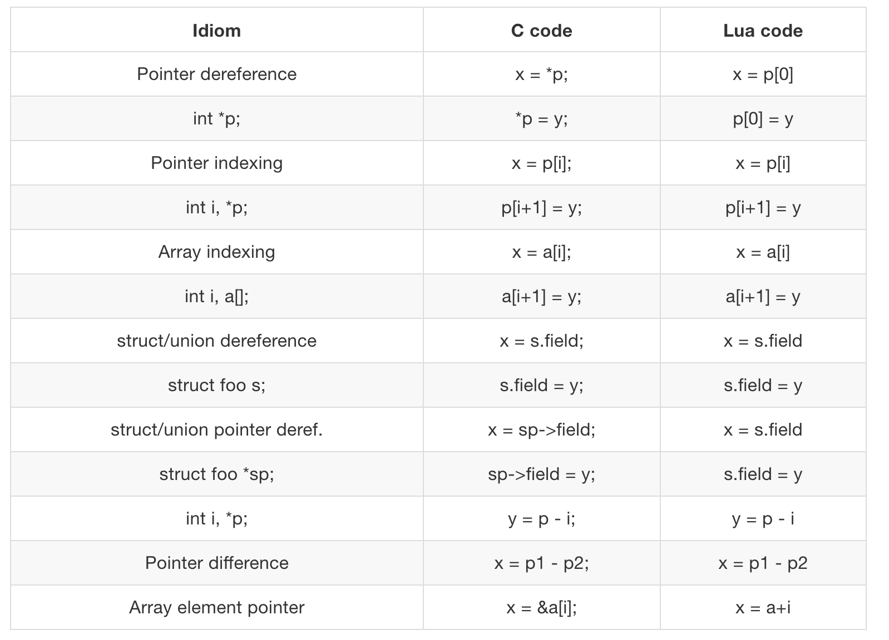

# FFI

FFI 库，是 LuaJIT 中最重要的一个扩展库。它允许从纯 Lua 代码调用外部C函数，使用 C 数据结构。有了它，就不用再像 Lua 标准 math 库一样，编写 Lua 扩展库。把开发者从开发 Lua 扩展 C 库（语言/功能绑定库）的繁重工作中释放出来。学习完本小节对开发纯 ffi 的库是有帮助的，像 lru-resty-lrucache 中的 pureffi.lua，这个纯 ffi 库非常高效地完成了 lru 缓存策略。

简单解释一下 Lua 扩展 C 库，对于那些能够被 Lua 调用的 C 函数来说，它的接口必须遵循 Lua 要求的形式，就是`typedef int (*lua_CFunction)(lua_State* L)`，这个函数包含的参数是 lua 状态指针 L。可以通过这个指针进一步获取通过 Lua 代码传入的参数。这个函数的返回值类型是一个整型，表示返回值的数量。需要注意的是，用 C 编写的函数无法把返回值返回给 Lua 代码，而是通过虚拟栈来传递 Lua 和 C 之间的调用参数和返回值。不仅在编程上开发效率变低，而且性能上比不上 FFI 库调用 C 函数。

FFI 库最大限度的省去了使用 C 手工编写繁重的 Lua/C 绑定的需要。不需要学习一门独立/额外的绑定语言——它解析普通 C 声明。这样可以从 C 头文件或参考手册中，直接剪切，粘贴。它的任务就是绑定很大的库，但不需要捣鼓脆弱的绑定生成器。

FFI 紧紧的整合进了 LuaJIT（几乎不可能作为一个独立的模块）。JIT 编译器在 Lua 代码直接访问 C 数据结构上所产生的代码，等同于一个 C 编译器应该生产的代码。在 JIT 编译过的代码中，调用 C 函数，可以被内连处理，不同于基于 Lua/C API 函数调用。

### ffi 库 词汇
cdecl: 一个抽象的C类型定义(其实是一个lua字符串)  
ctype: 一个C类型对象  
cdata: 一个C数据对象  
ct:    一个C类型格式，就是一个模板对象，可能是cdecl,cdata,ctype  
cb:    一个回调对象  
VLA:   一个可变长度的数组  
VLS:   一个可变长度的结构体  

### ffi.\*API
毫无疑问，在 lua 文件中使用 ffi 库的时候，必须要有下面的一行  
```lua
local ffi = require "ffi"
```
#### ffi.cdef(def)
功能：声明 C 函数或者 C 的数据结构
数据结构可以是结构体、枚举或者是联合体  
函数可以是 C 标准函数，或者第三方库函数，也可以是自定义的函数，注意这里只是函数的声明，并不是函数的定义。声明的函数应该要和原来的函数保持一致  
```lua
ffi.cdef[[
typedef struct foo { int a, b; } foo_t;  /* Declare a struct and typedef.   */
int printf(const char *fmt, ...);        /* Declare a typical printf function. */
]]
```
并不是所有的 C 标准函数都能满足我们的需求，那么如何使用第三方库函数或自定义的函数呢，这会稍微麻烦一点，不用担心，你可以很快学会 : )  
首先创建一个 myffi.c，其内容是  
```c
int add(int x, int y)
{
  return x + y;
}
```
接下来在 Linux 下生成动态链接库  
```shell
gcc -g -o libmyffi.so -fpic -shared myffi.c
```
为了方便我们测试，我们在 LD_LIBRARY_PATH 这个环境变量中加入了刚刚库所在的路劲，因为编译器在查找动态库所在的路径的时候其中一个环节就是在 LD_LIBRARY_PATH 这个环境变量中的所有路劲进行查找。命令如下所示。  
`export LD_LIBRARY_PATH=$LD_LIBRARY_PATH:your_lib_path`

在 lua 代码中要增加如下的行
```lua
ffi.load(name [,global])
```
ffi.load会通过给定的 name 加载动态库，返回一个绑定到这个库符号的新的 C 库命名空间，在 POSIX 系统中，如果 global 被设置为 ture，这个库符号被加载到一个全局命名空间。另外这个 name 可以是一个动态库的路径，那么会根据路劲来查找，否则的话会在默认的搜索路径中去找动态库。在 POSIX 系统中，如果在 name 这个字段中没有写上点符号“.”，那么“.so”将会被自动添加进去，例如 ffi.load("z") 会在默认的共享库搜寻路劲中去查找“libz.so”，在windows系统，如果没有包含点号，那么“.dll”会被自动加上。

下面看一个完整例子 test.lua：
```lua
local ffi = require "ffi"
local myffi = ffi.load('myffi')

ffi.cdef[[
int add(int x, int y);   /*don't forget to declare*/
]]

local res = myffi.add(1, 2)
print(res)
```
输出结果：
```shell
luajit test.lua
3
```
除此之外，还能使用 `ffi.C` (调用 ffi.cdef 中声明的系统函数) 来直接调用 add 函数，记得要在 ffi.load 的时候加上参数 true，例如 `ffi.load('myffi', true)`

完整的代码如下所示：
```lua
local ffi = require "ffi"
ffi.load('myffi',true)

ffi.cdef[[
int add(int x, int y);   /*don't forget to declare*/
]]

local res = ffi.C.add(1, 2)
print(res)
```
#### ffi.typeof
`ctype = ffi.typeof(ct)`  
功能：创建一个 ctype 对象，会解析一个抽象的 C 类型定义（cdecl）
```lua
local uintptr_t = ffi.typeof("uintptr_t")
local c_str_t = ffi.typeof("const char*")
local int_t = ffi.typeof("int")
local int_array_t = ffi.typeof("int[?]")
```

#### ffi.new
`cdata = ffi.new(ct [,nelem] [,init...])`  
功能：开辟空间, ，第一个参数为 ctype 对象，ctype 对象通过`ctype = ffi.typeof(ct)`构建
```lua
local int_array_t = ffi.typeof("int[?]")
local bucket_v = ffi.new(int_array_t, bucket_sz)

local queue_arr_type = ffi.typeof("lrucache_pureffi_queue_t[?]")
local q = ffi.new(queue_arr_type, size + 1)
```

#### ffi.fill
`ffi.fill(dst, len [,c])`  
功能：填充数据  
此函数和 memset(dst, c, len) 类似，注意参数的顺序  
```lua
ffi.fill(self.bucket_v, ffi_sizeof(int_t, bucket_sz), 0)
ffi.fill(q, ffi_sizeof(queue_type, size + 1), 0)
```
#### ffi.cast
`cdata = ffi.cast(ct, init)`  
功能：创建一个 scalar cdata 对象  
```lua
local c_str_t = ffi.typeof("const char*")
local c_str = ffi.cast(c_str_t, str)       /*转换为指针地址*/

local uintptr_t = ffi.typeof("uintptr_t")
tonumber(ffi.cast(uintptr_t, c_str))       /*转换为数字*/
```

相信看完上面的 API 你已经很累了，再坚持一下吧！休息几分钟后，让我们来看看下面对官方文档中的示例做剖析，希望能再加深你对 ffi 的理解。

#### 调用 C 函数

真的很用容易去调用一个外部C库函数，示例代码：

```lua
local ffi = require("ffi")
ffi.cdef[[
int printf(const char *fmt, ...);
]]
ffi.C.printf("Hello %s!", "world")
```

以上操作步骤，如下：

1. 加载 FFI 库。
1. 为函数增加一个函数声明。这个包含在 `中括号` 对之间的部分，是标准C语法。
1. 调用命名的 C 函数——非常简单。

事实上，背后的实现远非如此简单：③ 使用标准C库的命名空间 ffi.C。通过符号名 ("printf") 索引这个命名空间，自动绑定标准 C 库。索引结果是一个特殊类型的对象，当被调用时，执行 printf 函数。传递给这个函数的参数，从 Lua 对象自动转换为相应的 C 类型。

再来一个源自官方的示例代码：

```lua
local ffi = require("ffi")
ffi.cdef[[
unsigned long compressBound(unsigned long sourceLen);
int compress2(uint8_t *dest, unsigned long *destLen,
        const uint8_t *source, unsigned long sourceLen, int level);
int uncompress(uint8_t *dest, unsigned long *destLen,
         const uint8_t *source, unsigned long sourceLen);
]]
local zlib = ffi.load(ffi.os == "Windows" and "zlib1" or "z")

local function compress(txt)
  local n = zlib.compressBound(#txt)
  local buf = ffi.new("uint8_t[?]", n)
  local buflen = ffi.new("unsigned long[1]", n)
  local res = zlib.compress2(buf, buflen, txt, #txt, 9)
  assert(res == 0)
  return ffi.string(buf, buflen[0])
end

local function uncompress(comp, n)
  local buf = ffi.new("uint8_t[?]", n)
  local buflen = ffi.new("unsigned long[1]", n)
  local res = zlib.uncompress(buf, buflen, comp, #comp)
  assert(res == 0)
  return ffi.string(buf, buflen[0])
end

-- Simple test code.
local txt = string.rep("abcd", 1000)
print("Uncompressed size: ", #txt)
local c = compress(txt)
print("Compressed size: ", #c)
local txt2 = uncompress(c, #txt)
assert(txt2 == txt)
```

解释一下这段代码。  我们首先使用 `ffi.cdef` 声明了一些被 zlib 库提供的 C 函数。然后加载 zlib 共享库，在 Windows 系统上，则需要我们手动从网上下载 zlib1.dll 文件，而在 POSIX 系统上 libz 库一般都会被预安装。因为 `ffi.load` 函数会自动填补前缀和后缀，所以我们简单地使用 z 这个字母就
可以加载了。我们检查 `ffi.os`，以确保我们传递给 `ffi.load` 函数正确的名字。


一开始，压缩缓冲区的最大值被传递给 `compressBound`函数，下一行代码分配了一个要压缩字符串长度的字节缓冲区。``[?]``意味着他是一个变长数组。它的实际长度由`ffi.new`函数的第二个参数指定。

我们仔细审视一下`compress2`函数的声明就会发现，目标长度是用指针传递的！这是因为我们要传递进去缓冲区的最大值，并且得到缓冲区实际被使用的大小。

在C语言中，我们可以传递变量地址。但因为在Lua中并没有地址相关的操作符，所以我们使用只有一个元素的数组来代替。我们先用最大缓冲区大小初始化这唯一一个元素，接下来就是很直观地调用`zlib.compress2`函数了。使用`ffi.string`函数得到一个存储着压缩数据的Lua字符串，这个函数需要一个指向数据起始区的指针和实际长度。实际长度将会在`buflen`这个数组中返回。因为压缩数据并不包括原始字符串的长度，所以我们要显式地传递进去。

#### 使用 C 数据结构

cdata 类型用来将任意 C 数据保存在 Lua 变量中。这个类型相当于一块原生的内存，除了赋值和相同性
判断，Lua 没有为之预定义任何操作。 然而，通过使用 metatable （元表） ，程序员可以为 cdata
自定义一组操作。 cdata 不能在 Lua 中创建出来，也不能在 Lua 中修改。这样的操作只能通过 C API。这一点保证了宿主程序完全掌管其中的数据。

我们将C语言类型与 metamethod （元方法）关联起来，这个操作只用做一次。`ffi.metatype`会返回一个该类型的构造函数。原始C类型也可以被用来创建数组，元方法会被自动地应用到每个元素。

尤其需要指出的是，metatable 与 C 类型的关联是永久的，而且不允许被修改，\_\_index 元方法也是。

>下面是一个使用 C 数据结构的实例

```lua
local ffi = require("ffi")
ffi.cdef[[
typedef struct { double x, y; } point_t;
]]

local point
local mt = {
  __add = function(a, b) return point(a.x+b.x, a.y+b.y) end,
  __len = function(a) return math.sqrt(a.x*a.x + a.y*a.y) end,
  __index = {
    area = function(a) return a.x*a.x + a.y*a.y end,
  },
}
point = ffi.metatype("point_t", mt)

local a = point(3, 4)
print(a.x, a.y)  --> 3  4
print(#a)        --> 5
print(a:area())  --> 25
local b = a + point(0.5, 8)
print(#b)        --> 12.5
```


>附表：Lua 与 C 语言语法对应关系



#### 内存问题

todo：介绍 FFI 就必须从必要的 C 基础，包括内存管理的细节，说起，同时也须介绍包括 Valgrind 在内的内存问题调试工具的细节（by agentzh），后面重点补充。
