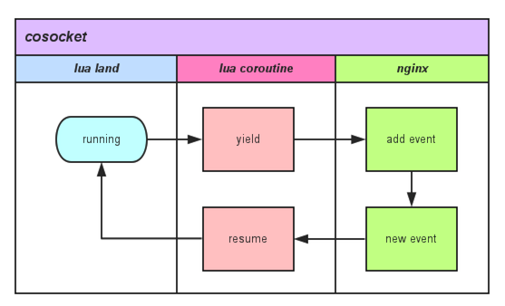

# 怎样理解 cosocket

笔者认为，cosocket 是 OpenResty 世界中技术、实用价值最高的部分。让我们可以用非常低廉的成本，优雅的姿势，比传统 socket 编程效率高好几倍的方式进行网络编程。无论资源占用、执行效率、并发数等都非常出色。

鲁迅有句名言“其实世界上本没有路，走的人多了便有了路”，其实对于 cosocket 的中文翻译貌似我也碰到了类似的问题。当我想给大家一个正面解释，爬过了官方 wiki 发现，原来作者本人（章亦春）也没有先给出 cosocket 定义。

看来只能通过一些侧面信息，从而让这条路逐渐的清晰起来。

> cosocket = coroutine + socket
> coroutine：协同程序（后面简称：协程）
> socket：网络套接字

OpenResty 中的 cosocket 不仅需要协程特性支撑，它还需 nginx 非常最重要的一部分“事件循环回调机制”，两部分拼在一起才达到了最后的 cosocket 效果，再结合 nginx 自身对各种资源的“小气”，使得整体加分不少。在 Lua 世界中调用任何一个有关 cosocket 网络函数内部关键调用如图所示：

从该图中我们可以看到，用户的 Lua 脚本每触发一个网络操作，都会触发一个协程的 yield 以及 resume，因为每请求的 Lua 脚本实际上都运行在独享协程之上，可以在任何需要的时候暂停自己（yield），也可以在任何需要的时候被唤醒（resume）。

暂停自己，把网络事件注册到 Nginx 监听列表中，并把运行权限交给 Nginx。当有 Nginx 注册网络事件达到触发条件时，唤醒对应的协程继续处理。

依此为蓝板，封装实现 connect、read、recieve 等操作，形成了大家目前所看到的 cosocket API。

可以看到，cosocket 是依赖 Lua 协程 + nginx 事件通知两个重要特性拼的。

从 0.9.9 版本开始，cosocket 对象是全双工的，也就是说，一个专门读取的 "light thread"，一个专门写入的 "light thread"，它们可以同时对同一个 cosocket 对象进行操作（两个 "light threads" 必须运行在同一个 Lua 环境中，原因见上）。但是你不能让两个 "light threads" 对同一个 cosocket 对象都进行读（或者写入、或者连接）操作，否则当调用 cosocket 对象时，你将得到一个类似 "socket busy reading" 的错误。

所以东西总结下来，到底什么是 cosocket，中文应该怎么翻译，笔者本人都开始纠结了。我们不妨从另外一个角度来审视它，它到底给我们带来了什么。

* 它是异步的；
* 它是非阻塞的；
* 它是全双工的；

> 同步与异步解释：
> 同步：做完一件事再去做另一件；
> 异步：同时做多件事情，某个事情有结果了再去处理。

> 阻塞与非阻塞解释：
> 阻塞：不等到想要的结果我就不走了；
> 非阻塞：有结果我就带走，没结果我就空手而回，总之一句话：爷等不起。

异步／同步是做事派发方式，阻塞／非阻塞是如何处理事情，两组概念不在同一个层面。

无论 ngx.socket.tcp()、ngx.socket.udp()、ngx.socket.stream()、ngx.req.socket()，它们基本流程都是一样的，只是一些细节参数上有区别（比如 TCP 和 UDP 的区别）。下面这些函数，都是用来辅助完成更高级的 socket 行为控制：

* connect
* sslhandshake
* send
* receive
* close
* settimeout
* setoption
* receiveuntil
* setkeepalive
* getreusedtimes

它们不仅完整兼容 LuaSocket 库的 TCP API，而且还是 100% 非阻塞的。

对 cosocket 做了这么多铺垫，到底他有多么重要呢？直接看一下官方默认绑定包有多少是基于 cosocket 的：

* [ngx_stream_lua_module](https://github.com/openresty/stream-lua-nginx-module#readme) Nginx "stream" 子系统的官方模块版本（通用的下游 TCP 对话）。
* [lua-resty-memcached](https://github.com/openresty/lua-resty-memcached) 基于 ngx_lua cosocket 的库。
* [lua-resty-redis](https://github.com/openresty/lua-resty-redis) 基于 ngx_lua cosocket 的库。
* [lua-resty-mysql](https://github.com/openresty/lua-resty-mysql) 基于 ngx_lua cosocket 的库。
* [lua-resty-upload](https://github.com/openresty/lua-resty-upload) 基于 ngx_lua cosocket 的库。
* [lua-resty-dns](https://github.com/openresty/lua-resty-dns) 基于 ngx_lua cosocket的库。
* [lua-resty-websocket](https://github.com/openresty/lua-resty-websocket) 提供 WebSocket 的客户端、服务端，基于 ngx_lua cosocket 的库。

效仿这些基础库的封装方法，可以很容易完成不同系统或组件的对接，例如 syslog、beanstalkd、mongodb 等，直接 copy 这些组件的通讯协议即可。
