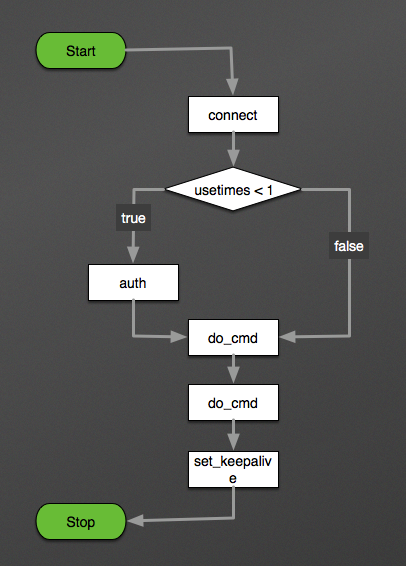

# 如何在后台开启轻量级线程完成定时任务？

> Question:

现在有一个场景：需要定时（30s）从redis里面拉取数据灌入 lua cache 共享内存。我现在是用 [ngx.timer](https://github.com/iresty/nginx-lua-module-zh-wiki#ngxtimerat) 这个 API 来实现的，请问这会不会有问题？因为对 [ngx.timer](https://github.com/iresty/nginx-lua-module-zh-wiki#ngxtimerat) 这个 API 不是很了解看了文档说是：在后台开启了一个轻量级线程来执行，与原来的请求脱钩。场景需求是拉取灌入的操作不能阻塞 worker 。

1. 请问这样能够满足需求吗？会不会有阻塞问题？
2. [ngx.timer](https://github.com/iresty/nginx-lua-module-zh-wiki#ngxtimerat) 我现在是放在 content_by_lua_file 中的，需要访问接口才能启动，有没有可以开启 worker 的时候就启动 timer 的办法（我试了放在 init_by_lua_file 里面好像不生效。。。）
3. 这个 timer 是每个 worker 里面都会有还是只有一个 worker 里面会有呢？（看文档貌似是只有一个 worker 里面会有，这也是我的需求）

> Answer:

1. 请问这样能够满足需求吗？会不会有阻塞问题？

    只要使用的都是 OpenResty 的 API 和库，是不存在阻塞问题的。只要大体确认一下当前 nginx 进程负载压力不要太高，能够确定获取到工作时间片即可。

2. 有没有可以开启 worker 的时候就启动 timer 的办法 。。。

    其实这里你已经点出关键字了，借助 [init_worker_by_lua](https://github.com/iresty/nginx-lua-module-zh-wiki#init_worker_by_lua) 即可。

3. 这个 timer 是每个 worker 里面都会有还是只有一个 worker 。。。

    通过 [init_worker_by_lua](https://github.com/iresty/nginx-lua-module-zh-wiki#init_worker_by_lua) 启动的 [ngx.timer](https://github.com/iresty/nginx-lua-module-zh-wiki#ngxtimerat) 是对每个 worker 的。如果这里需要控制 timer 的存在数量，可以借助 [ngx.worker.id](https://github.com/iresty/nginx-lua-module-zh-wiki#ngxworkerid) 完成 [ngx.timer](https://github.com/iresty/nginx-lua-module-zh-wiki#ngxtimerat) 数量控制，比如只启动一个或多个，并让他们确定绑定在哪个 worker 上。

# 如何使用 os.getenv 获取系统环境变量

> Question： 如题

> Answer：

如果你想在 Lua 中通过标准 Lua API [os.getenv](http://www.lua.org/manual/5.1/manual.html#pdf-os.getenv) 来访问系统环境变量，例如 `foo` ， 那么你需要在你的 nginx.conf 中，通过 [env](http://nginx.org/en/docs/ngx_core_module.html#env) 指令，把这个环境变量列出来。 例如：

    env foo;

# [lua-resty-mongol3](https://github.com/LuaDist2/lua-resty-mongol3) 用户名、密码验证部分占用时间过长

> Question

    这个库的使用流程大致如下：

    1. 创建一个 mongo 对象（local conn =mongo:new()）
    2. 创建一个连接 mongodb（conn:connect("192.168.1.254",27017)）
    3. 选择数据库（local db = conn:new_db_handle("openresty")）
    4. 然后 auth 验证（db:auth_scram_sha1("username","password")）
    5. 接收数据执行 insert 操作
    6. 放入连接池（conn:set_keepalive(10000, 100)）

    主要问题是用户登录部分占用将近 1/3 的时间，这个合理么？如何优化？

> Answer

为了回答上面的问题，我们先粗略整理一下数据库连接池的通常做法，看下面流程图：

主要区别在于如何减少不必要的用户验证过程，合理高效的复用已有连接。两边对比后我们可以明显发现，为了数据执行 insert 操作，mongo 目前需要每次都进行冗余的 auth 步骤，其实对于已经验证过的连接，直接使用即可。

比较推荐的改进方法，参考 [lua-resty-mysql](https://github.com/openresty/lua-resty-mysql) 的实现，对不同 ip、port、db、user、password 绑定不同的连接池名字，让不同连接目的连接归类存放，并在数据库层直接完成用户验证动作。

